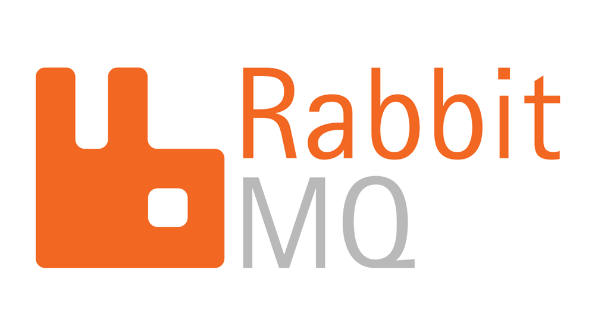

# The Pub/Sub Design pattern
> An architectural design pattern in `distributed` system for `asynchronous` communication.

## Pub/Sub Architecture

Pub/Sub pattern consists of the following components:
1. **Publisher**:
    - Publishers are components or entities that **generate** events or messages. 
    - **Does not know** the Subscribers
    - When something significant happens, publishers create a message containing relevant information and send it out to a message broker.
2. **Subscriber**:
    - Subscribers are components or entities interested in receiving messages about particular topics or events
    - Sender do not directly address the receiver, instead the **receiver/subscriber express interest** in certain topics/events.
3. **Message Broker**
    - There is a central component called the message broker or hub that **manages the routing of messages** from publishers to subscribers
    -  It **maintains a registry of topics** and the list of subscribers interested in each topic.
    - When a message is published to a topic, the broker **forwards the message to all subscribers** registered for that topic
4. **Topic**
    - Pub/Sub systems often **organize messages around topics or channels**.
    - Publishers publish messages to specific topics, and subscribers subscribe to the topics they are interested in.
    - This **decouples** the publishers and subscribers.

## Advantages of pub/sub
1. Loose Coupling
    - Publishers and subscribers don't need to know each other, making the system flexible and scalable.
2. Asynchronous Communication
    - Messages are delivered as soon as they arrive, regardless of subscriber availability.
3. High Scalability
    - Allow any number of publisher to communicate with any number of subscriber.

## Disadvantages of pub/sub
1. Complexity
    - Introduces additional complexity. Managing topics, subscriptions, and message routing requires careful design and maintenance
2. Potential for Message Loss
    - Messages may be lost. It also depends on the message brokers and how they were implemented
3. Overhead
    -  Introduce overhead in terms of message routing, serialization, and network communication

## When to use pub/sub

1. Real-time data updates. (Sending Notifications)
2. Distributed caching
3. Distributed logging
4. Broadcasting updates

## When not to use pub/sub

1. Ordered message processing
2. Two-way communication
3. Not suitable for media streamming
4. Synchronous communication

## Popular Frameworks/Technologies for Pub/Sub
|  |  |
| ----------- | ----------- |
| **Apache Kafka** |  |
| **Apache Pulsar**   |  |
|  **RabbitMQ** |  |
| **Redis Pub/Sub** |  |

<!-- Notes:
1. Distributed system will not have permenant connection between two system
2. What happens if the server dies? will client be able to retrive them?
Ans: messages should stay even in case of failure.
3. For distributed systems we need to think about persistent storage -->
