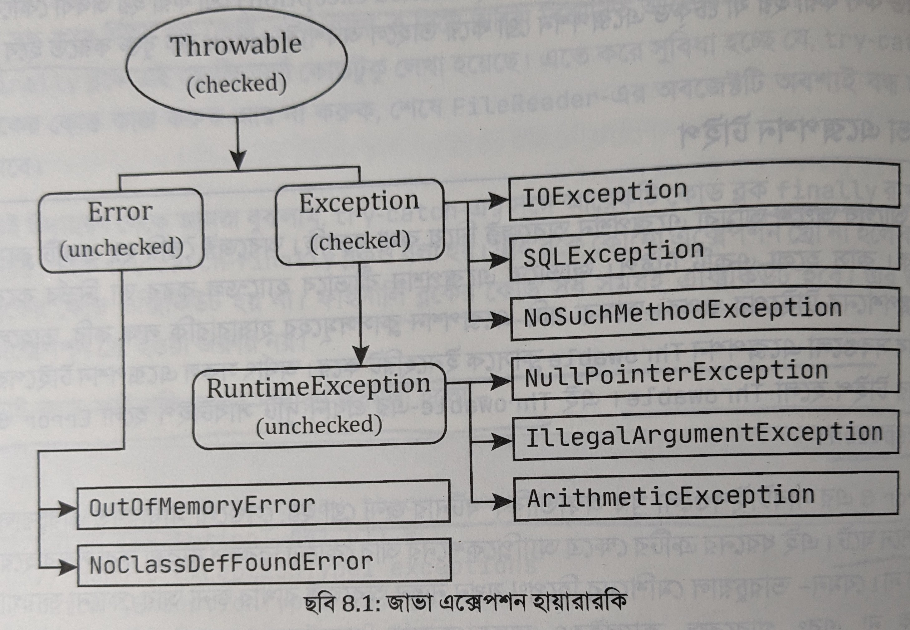

# Exception Handling in Java


# Contents
1. [Introduction]()
2. [Types of Exceptions]()
3. [Exception Handling Mechanisms]()
4. [Common Exception Classes]()
5. [Best Practices for Exception Handling]()
6. [Custom Exceptions]()
7. [Conclusion]()
<!-- 8. [Bonus]() -->

# Introduction
> an event, which occurs during the execution of a program, that disrupts the normal flow of the program's instructions. 

    When an error occurs within a method, the method creates an object and hands it off to the runtime system.

### Why do we need exception handling?
- To avoid program / system crash

    ```java
    public int stringToNumber(String numberString){
        int number;
        try{
            number = Integer.parseInt(numberString);
        } catch (NumberFormatException e){
            System.out.println("caught number format exception");
            number = 0;
        }
        return number;
    }
    ```


# Exception Handling Mechanisms
## try-catch block:

**Basic Syntax**
```java
try {
    // code that may cause exception
} catch (Throwable ex){
    // Action to be preformed when exception arises
}
```

- The code that may cause exception goes inside this block goes inside `try` block
- The action that is preformed when the exception arises goes inside `catch` block
- There can be multiple `catch` blocks for each `try` block
    ```java
    try {
        // code that may cause exception
    } catch (ExceptionType ex){ // first catch block
        
    }catch (AnotherExceptionType ex){ // second catch block
        
    }
    ```
- The `catch` syntax takes an argument which denotes the type of exception and since there can be multiple types of exception hence multiple `catch` block allowed

    ```java
    try{
        // some code
    } catch (IndexOutOfBoundsException e){
        System.out.println("Caught index out of bounds exception");
    } catch (IOException e){
        System.out.println("Caught IOException");
    } 
    ```
- After Java 7 a catch block can handle multiple exceptions
    ```java
    try{
        // some code
    } catch (IndexOutOfBoundsException | IOException e){
        System.out.println("Caught an exception");
    }
    ```
 

## Finally block:
- No matter if an exception occurs or not this block will always be executed
    ```java
        try {
            // code that may cause exception
        } catch (ExceptionType1 e1){
            // Action to be preformed when exception1 arises
        } catch (ExceptionType2 e2){
            // Action to be preformed when exception2 arises
        } finally {
            // this block will always be executed
        }
    ```
- The runtime system always executes the statements within the `finally` block regardless of what happens within the `try` block. So it's the perfect place to perform cleanup. 

    The following finally block for the writeList method cleans up and then closes the PrintWriter and FileWriter. [[2]](#references)
    ```java
    try {
            // Some code
        } catch (IOException e){

            System.out.println("Caught IOException");

        } finally {

            if (out != null) {
                System.out.println("Closing PrintWriter");
                out.close();
            } else {
                System.out.println("PrintWriter not open");
            }

            if (f != null) {
                System.out.println("Closing FileWriter");
                f.close();
            }
        }
    ```
    - So like the above example `finally` block can be used to close resource
    - can be used to release locks acquired on **shared resources** to prevent deadlocks
    - Cleaning Up Temporary Resources
    ```java
    File tempFile = File.createTempFile("temp", ".txt");
    try {
        // Use the temporary file
    } finally {
        tempFile.delete(); // Clean up the temporary file
    }
    ```
- Lastly, the `try` block can be used with `finally` block without the **catch** block.
    ```java
    try {
        // some code
    } finally {
        // Code always executed after the 
        // try and any catch block doesn't matter
        // if an exception is thrown or not
    }
    ```
    > **Warning !!!** if try block throw checked exception then you must add the catch block. [[3]](#references)

- The finally block will always execute unless [[3]](#references)
    - `System.exit()` is called 
    - The JVM crashes
    - the `try{}` block never ends (e.g. endless loop)


# Java Exception Hierarchy:
> The Throwable class is the superclass of all `errors` and `exceptions` in the Java language. [[4]](#references)


Figure: Java Exception Hierarchy [[5]](#references)

# Exception vs Error [[6]](#references)


| Topic    |      Error    |  Exception |
|----------|:-------------|:------|
| **Definition** |A serious problem that typically indicates a system issue or resource limitation. | An event that disrupts the normal flow of a program but can be potentially handled and recovered from |
|**Recovery**| difficult or impossible to recover from | sing exception handling mechanisms like try-catch blocks |
|**Checked vs. Unchecked**|All errors are unchecked exceptions|Exceptions can be either checked or unchecked|
| **Example** |    Out of memory error, system crash   |   NullPointerException, ArithmeticException, FileNotFoundException |


# Types of Exceptions
## Checked Exceptions
> These are the exceptions that are checked at **compile time**. 

If some code within a method throws a checked exception, then the method must either **handle** the exception or it must specify the exception using the **throws** keyword. This requirement is called `check-or-declare-requirement` [[5]](#references).

Examples: 

```java
public int stringToNumber(String numberString){
    int number;
    try{
        number = Integer.parseInt(numberString);
    } catch (NumberFormatException e){
        System.out.println("caught number format exception");
        number = 0;
    }
    return number;
}
```


```java
public int stringToNumber(String numberString) throws NumberFormatException {
    int number = Integer.parseInt(numberString);
    return number;
}
```

## Unchecked Exceptions
> These are the exceptions that are not checked at compile time. n Java, exceptions under Error and RuntimeException classes are unchecked exceptions, everything else under throwable is checked [[7]](#references).

- Rule of thumb: The later you catch exception the better. One example might be that catching exception in `controller` in spring boot application.

- Unchecked exception are not need to declare in method signature[[5]](#references).


# Exception declaration and Throwing

- As described [above](#checked-exceptions) if a method throws exception we can add it to method signature
- We can also manually `throw` exception
    ```java
    public class Calculator{
        public int divide(int a, int b){
            if(b<0){
                throw new IllegalArgumentException("Argument can not be negative");
            }
            return a/b;
        }
    }
    ```

# Exception Information
> Inside the catch block we can get information about the exception

These methods can be used to get information from an exception
- **getMessage()**:Returns why the exception occurs
- **toString()**: Return short description of the exception
- **printStackTrace()**: print the details of an exception to the standard error output stream


# Common Exception Classes:
- ArithmeticException
- NumberFormatException
- ClassNotFoundException
- SQLException
- MalformedURLException
- NullPointerException
- ArrayIndexOutOfBountException
- IllegalStateException
- ClassCastException
- StackOverflowError
- NoClassDefFoundError
- CloneNotSupportedException
- FileNotFoundException
- IOException

# User Defined Exception
We can use custom exception to our need.

- If we need to write a `checked` exception then we can extend `Exception` class
    ```java
    public class MyCheckedException extends Exception {
        public MyCheckedException(String message){
            super(message);
        }
    }
    ```

- Or if we want to write an `Unchecked` exception then we can extend `RuntimeException`

```java
public class MyUncheckedException extends RuntimeException {
    public MyUncheckedException(String message){
        super(message);
    }
}
```

# Best Practices for Exception Handling (Incomplete: missing example) [[5]](#references)[[8]](#references):

- Exception is for exceptional situation and should not be used a normal program flow 
- Catch the Most Specific Exception First
    ```java
    public void catchMostSpecificExceptionFirst() {
        try {
            doSomething("A message");
        } catch (NumberFormatException e) {
            log.error(e);
        } catch (IllegalArgumentException e) {
            log.error(e)
        }
    }
    ```
- Try avoid throwing root exception. For example `NumberFormatException` exception is subclass of `RunTimeException`, so we can use it but it is not good practice.
- Use custom exception only if existing exception can not describe it
- When create custom exception class add the **Exception** with the class name for better readibility.
- Throw Exceptions With Descriptive Messages
- Do not use empty catch block
- Never use `break`   `continue` or  `return` type of statement inside `finally` block
- Whenever face exception immediately throw it
- Use finally block for resource cleanup, for java 
- Consider using `try-with-resources` statement (Java 7+) for automatic resource management.
- Don’t Log and Throw
    ```java
        try {
            new Long("xyz");
        } catch (NumberFormatException e) {
            log.error(e);
            throw e;
        }
    ```


# References
- [[1] What is an exception? (Oracle docs)](https://docs.oracle.com/javase/tutorial/essential/exceptions/definition.html#:~:text=Definition%3A%20An%20exception%20is%20an,off%20to%20the%20runtime%20system.)
- [[2] The finally Block (Oracle docs)](https://docs.oracle.com/javase/tutorial/essential/exceptions/finally.html)
- [[3] Java Try Catch Finally blocks without Catch (stack Overflow)](https://stackoverflow.com/questions/4559661/java-try-catch-finally-blocks-without-catch)
- [[4] Class Throwable (Oracle docs)](https://docs.oracle.com/javase%2F7%2Fdocs%2Fapi%2F%2F/java/lang/Throwable.html)
- [[5] জাভা প্রোগ্রামিং by  A N M Bazlur Rahman ](https://bazlur.com/posts/2018-02-16-java-programmin/)
- [[6]What is difference between Errors and Exceptions? (stack Overflow)](https://stackoverflow.com/questions/5813614/what-is-difference-between-errors-and-exceptions)
- [[7] Checked vs Unchecked Exceptions in Java (geeksforgeeks)](https://www.geeksforgeeks.org/checked-vs-unchecked-exceptions-in-java/)
- [[8] 9 Best Practices to Handle Exceptions in Java](https://stackify.com/best-practices-exceptions-java/)


