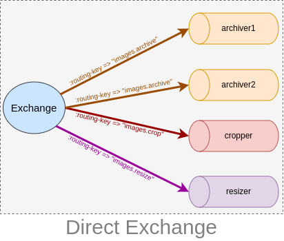
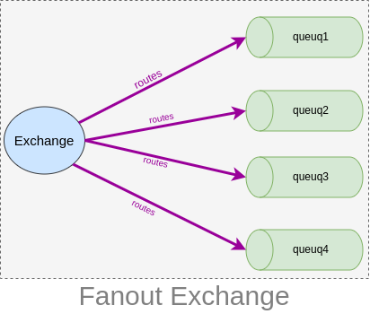

# Message Queue
> A message queue is a form of asynchronous service-to-service communication used in serverless and microservices architectures. Messages are stored on the queue until they are processed and deleted. Each message is processed only once, by a single consumer. [[1]](#references)

## Contents
1. [What is message queue?]()
2. [Why we need message queue?]()
3. [How a message queue works?]()
4. [Types of message queue]()
5. [Real world example of message queue]()

## What is a message queues?
A Message Queue is a form of communication and data transfer mechanism used in computer science and system design. It functions as a temporary storage and routing system for messages exchanged between different components, applications, or systems within a larger software architecture.

Example:

A real life exmple would be **food panda app**. We order food in food panda and get it by the delivey man. but how the restaurent knows, how the delivery driver know? Here a lot of parties are involved just like a distributed system. One party is the restaurent, another party is the delivery man and of course the person who place the order. Restaurent, the delivery person are working independently but they are being communicating through the food panda app. 

Likewise in large system different component work independently but communicate with each other through **message queue**.

Another nice example is how Starbucks works [[2]](#references).

## Why do we need message queue?
Now we know that message queue is for communicating between different components but why do we need message queue? Why not communicate with each other directly?

Actually there are couple of problems:
1. Each component will have to have some mechanism to communicate
2. Component will have to wait for response
3. It is not guaranteed that the receiver component have received the message
4. Communication is an extra burden on the module/component.
5. If system is very large then communication between will get messier.

So message queue solves these problems and do much more.

## Benefits of Message Queues [[2]](#references)
1. Asynchronous Processing
2. Decoupling
3. Fan-out
4. Rate Limiting
5. Message Persistence
6. Batch Processing
7. Message Ordering

## Types of Message Queue
1. **Point-to-point Message Queue:** Producer send message to a point-to-point message queue the. The message queue store the message. When a consumer consumes the message then the message is deleted from the message queue.
2. **Publish-Subscribe Message Queues:** It is more complex then P2P communication. Here different queue is maintained based on different topic. The publisher publish message to a specific queue. All the subscriber who are subscribed to the topic message queue get the message.

### Message Serialization
>Message Serialization is the process of converting complex data structures or objects into a format that can be easily transmitted, stored, or reconstructed [[3]](#references).

1. **JSON (`J`ava`S`cript `O`bject `N`otation):** Used for structured data and supported by many programming language.
2. **XML (e`X`tensible `M`arkup `L`anguage):** Like HTML but without predefined tags. You define your own tags as you need. Often used in web service and configuration files. 
3. **Protocol Buffers (protobuf):** Protocol Buffers are a language-neutral, platform-neutral extensible mechanism for serializing structured data. Developed by **google**.
4. **Binary Serialization:** Custom binary formats are used for performance-critical applications due to their compactness and speed.

## How a message queue works?

### Types of communication
1. **Synchronous Communication:** Services communicate with each other in a synchronous manner meaning that when a service send a request to another service it blocks and wait for the response before continuing its operation.
   
   Example
   1. HTTP Request-Response
   2. RPC (Remote Procedure Call)
2. **Asynchronous Communication:** In an synchronous communication services do not wait for response. Services work independently and do not wait for other service.
   
   Example:
   1. Message Queues (RabbitMQ, Kafka)
   2. Event-Driven Architecture
   3. Background Processing
   
        Microservices can offload long-running or non-urgent tasks to background processes

### Common Messaging Protocols 
1. MQTT (Message Queuing Telemetry Transport)
2. AMQP (Advanced Message Queuing Protocol)

## AMQP (`A`dvanced `M`essage `Q`ueuing `P`rotocol) [[4]](#references)
>AMQP is created as an open standard protocol that allows messaging interoperability between systems, regardless of message broker vendor or platform used

#### Brokers and Their Role
**Message broker** receives message from **publishers** and route them to the **consumers**. Since AMQP is a network protocol the message broker, publishers and consumers all can be on different machine.

### Overview of AMQP (0-9-1)
1. Messages are published to the **exchanges**. Exchange can compared with post office because they are responsible for the routing.
   1. Publisher can specify various message attributes when publishing a message. Broker can use some of the meta-data, however rest of it is completely opaque to the broker.

2. Exchange **routes/distribure** message copies to queues using rules called bindings.

3. Now the **broker** either deliver messages to consumers subscribed to the queus or consumers fetch/pull messages from queues on demand.
4. Sometimes due to network issue or the application may fail to process messages. So AMQP 0-9-1 model has a notion of **message acknowledgements**. When a message is delivered to a consumer the consumer **notifies the broker**, either automatically or as soon as the application developer chooses to do so. 
5. When message acknowledgements are in use, a broker will only completely remove a message from a queue when it receives a notification for that message (or a group of messages)
6. In certain situation, for example when a message can not be routed, messages may be returned to publishers, dropped or placed into a **dead letter queue**. 
   
   Dead Letter Queues (DLQs) are a mechanism for handling messages that cannot be processed successfully. This includes 
   1. Messages with error in their content or format
   2. Messages that exceed their time-to-live(TTL) or delivery attempts.
   3. Messages that can not be delivered to any consumer.

#### AMQP Entities
Queues, exchanges and bindings are collectively referred to as **AMQP entities**.

AMQP 0-9-1 is a programmable protocol in the sense that AMQP 0-9-1 entities and routing schemes are primarily defined by applications themselves, not a broker administrator.

### Exchanges and Exchange Types
Exchanges are AMQP 0-9-1 entities where messages are sent to. Exchanges take a message and route it into zero or more queues.

AMQP 0-9-1 brokers provide four exchange types:

<table><thead><th>Exchange type</th><th>Default pre-declared names</th></thead><tr><td>Direct exchange</td><td>(Empty string) and amq.direct</td></tr><tr><td>Fanout exchange</td><td>amq.fanout</td></tr><tr><td>Topic exchange</td><td>amq.topic</td></tr><tr><td>Headers exchange</td><td>amq.match (and amq.headers in RabbitMQ)</td></tr></table>

Besides the exchange type, exchanges are declared with a number of attributes:

- Name
- Durability (exchanges survive broker restart)
- Auto-delete (exchange is deleted when last queue is unbound from it)
- Arguments (optional, used by plugins and broker-specific features)

#### Direct Exchange
A direct exchange delivers messages to queues based on the message **routing key**. A direct exchange is ideal for the **unicast** routing of messages. They can be used for **multicast** routing as well.

1. A queue binds to the exchange with a routing key K
2. When a new message with routing key R arrives at the direct exchange, the exchange routes it to the queue if K = R
3. If multiple queues are bound to a direct exchange with the same routing key K, the exchange will route the message to all queues for which K = R

#### Fanout Exchange
A fanout exchange routes messages to all of the queues that are bound to it and the routing key is **ignored**. Ideal for the **broadcast** routing of messages.

## Example of Message Queue
1. RabbitMQ
2. Apache Kafka
3. ActiveMQ
4. Amazon Simple Queue Service
5. IBM MQ

## Temporary resources
1. [System Design - GeeksforGeeks](https://www.geeksforgeeks.org/message-queues-system-design/)
2. [How Message Queues Work in Distributed Systems - freeCodeCamp](https://www.freecodecamp.org/news/message-queues-in-distributed-systesms/)
3. [Messsage Broker vs Message Queue](https://www.svix.com/resources/faq/message-broker-vs-message-queue/)
4. [What is RabbitMQ - IBM Technology Youtube](https://www.youtube.com/watch?v=7rkeORD4jSw)
5. [RabbitMQ Tutorial - Message Queues and Distributed Systems - Amigoscode](https://www.youtube.com/watch?v=nFxjaVmFj5E&pp=ygUabWVzc2FnZSBicm9rZXIgYW1pZ29zIGNvZGU%3D)
6. [Kafka vs. RabbitMQ  - Jordan has no life](https://www.youtube.com/watch?v=_5mu7lZz5X4)

## References
1. [What is a Message Queue? - AWS](https://aws.amazon.com/message-queue/)
2. [Message Queue - BYTEBYTEGO](https://blog.bytebytego.com/p/why-do-we-need-a-message-queue)
3. [System Design - GeeksforGeeks](https://www.geeksforgeeks.org/message-queues-system-design/)
4. [AMQP 0-9-1 - RabbitMQ](https://www.rabbitmq.com/tutorials/amqp-concepts)
5. [What is AMQP - CloudAMQP](https://www.cloudamqp.com/blog/what-is-amqp-and-why-is-it-used-in-rabbitmq.html)